# README

<div align="center">
  <h1>🛍️ XMPY MALL</h1>
  <strong>카테고리별 상품 탐색부터 장바구니, 결제, 리뷰까지 — 쇼핑의 모든 것을 한 곳에서</strong>
</div>

<br />

## 📋 프로젝트 개요

- **프로젝트명**: XMPY MALL
- **팀명**: 1조
- **프로젝트 타입**: Full-stack Web Application (React + Spring Boot)

---

## 🎯 개발 배경

온라인 쇼핑몰의 핵심 기능인 **상품 탐색 → 장바구니 → 결제 → 리뷰** 흐름을 직접 구현하며, 실무에 가까운 쇼핑몰 서비스를 풀스택으로 경험하는 것을 목표로 제작되었습니다.

카테고리 기반 상품 분류, 베스트 상품 노출, 사이즈/색상 옵션별 재고 관리, 구매 후 리뷰 작성까지 실제 이커머스 플로우를 그대로 구현하였습니다.

---

## ✨ 주요 기능

### 🏠 홈 & 상품 탐색

**홈 화면**
- 베스트 상품을 Swiper 슬라이더로 노출
- 카테고리 드롭다운 네비게이션을 통한 빠른 이동

**베스트 페이지**
- 카테고리별 베스트 상품 목록 제공

**카테고리 상품 목록 페이지 (SubMenuPage)**
- 카테고리 상세별 상품 리스트 조회
- 페이지네이션 기반 탐색

**상품 상세 페이지**
- 상품 썸네일, 이름, 가격, 상세 설명 제공
- 사이즈 / 색상 옵션 선택 후 장바구니 담기
- 구매자 리뷰 목록 및 별점 확인

### 🛒 장바구니 & 결제

**장바구니 페이지**
- 담은 상품 목록 확인 및 수량 조절
- 선택 상품 삭제 및 전체 금액 합산

**결제 페이지**
- 배송지 입력 (Daum 우편번호 API 연동)
- 주문 상품 최종 확인 및 결제 처리

### ⭐ 리뷰

- 구매 완료된 상품에 한해 리뷰 작성 가능
- Quill 에디터를 이용한 서식 있는 리뷰 작성
- 별점 기반 평가

### 👤 마이페이지

**일반 유저**
- 내 정보 조회 및 수정 (프로필 이미지 포함)
- 주문 내역 조회
- 내가 작성한 리뷰 확인

**관리자 (OwnerPage)**
- 상품 등록 페이지: 카테고리, 이미지, 상세 정보, 옵션(사이즈/색상/재고) 입력
- 재고 관리 페이지: 상품별 사이즈/색상별 재고 수량 수정

### 🔐 인증

- 이메일 / 비밀번호 회원가입 및 로그인
- 회원가입 시 입력값 형식 검증
- JWT 기반 인증 (AccessToken → LocalStorage 저장)
- 역할 기반 접근 제어 (일반 유저 / 관리자)

---
## 🚀 주요 기능 화면

### 1. 홈
#### 홈 화면
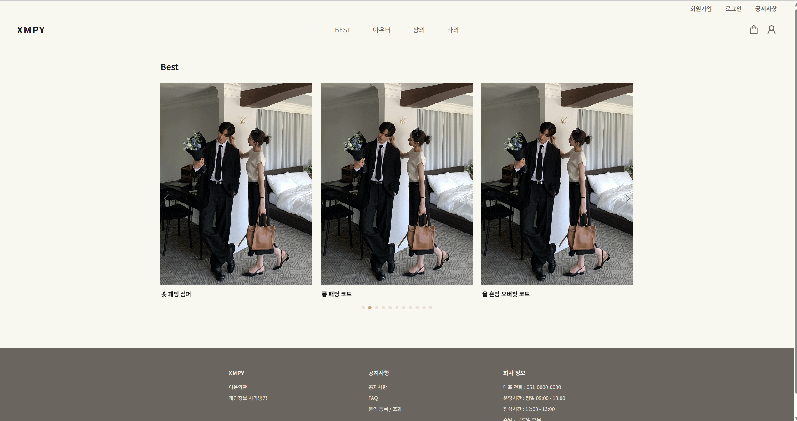

#### 베스트 슬라이더
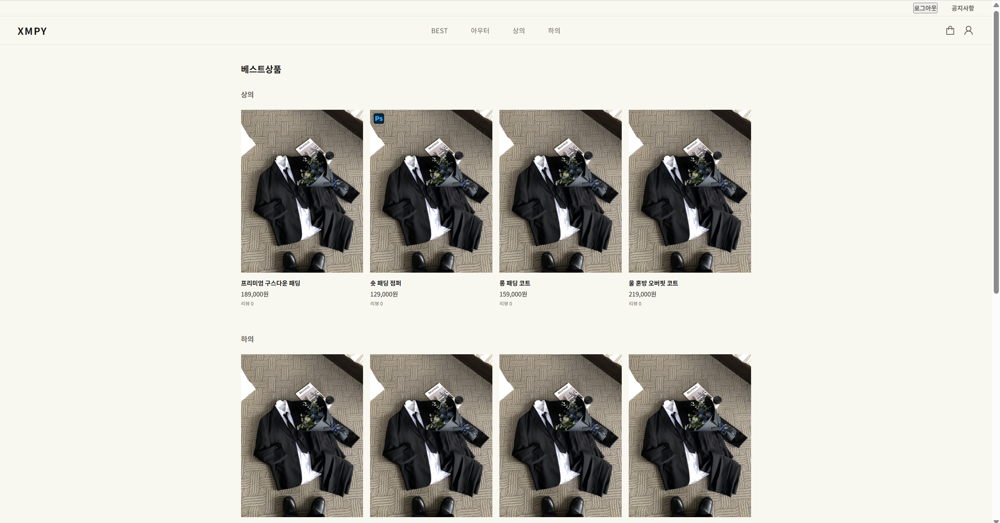

---

### 2. 상품 목록 & 상세
#### 카테고리 (상의 / 하의 / 아우터)
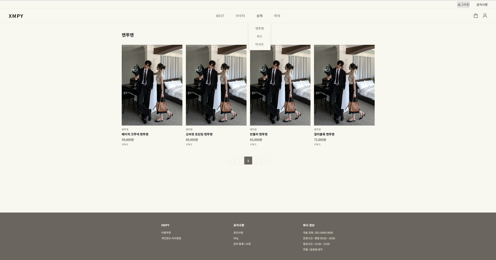
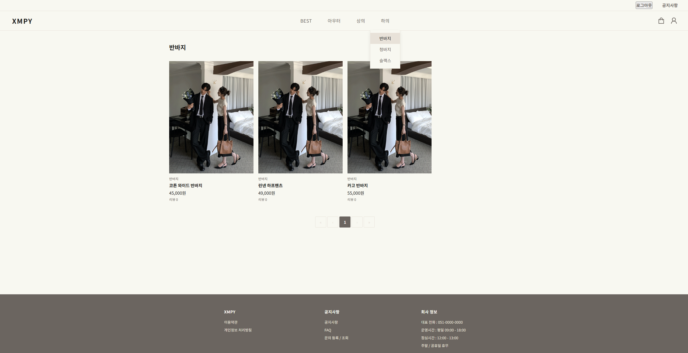
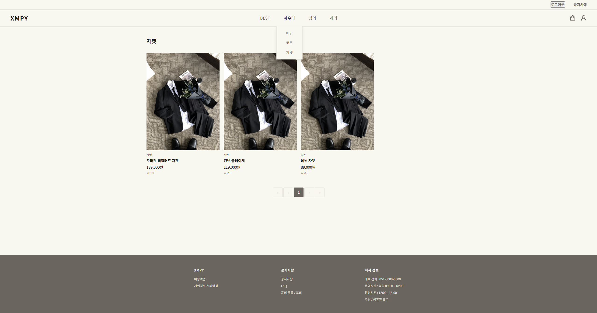

#### 상품 상세 / 주문
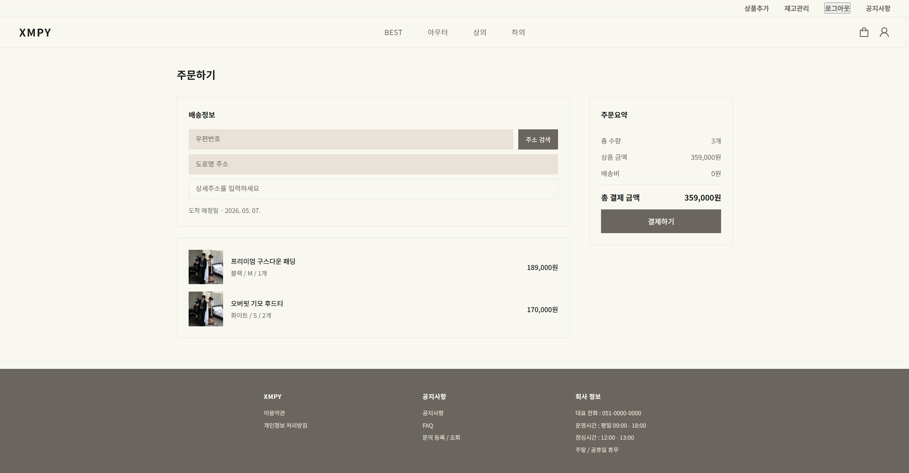

---

### 3. 장바구니 & 결제
#### 장바구니
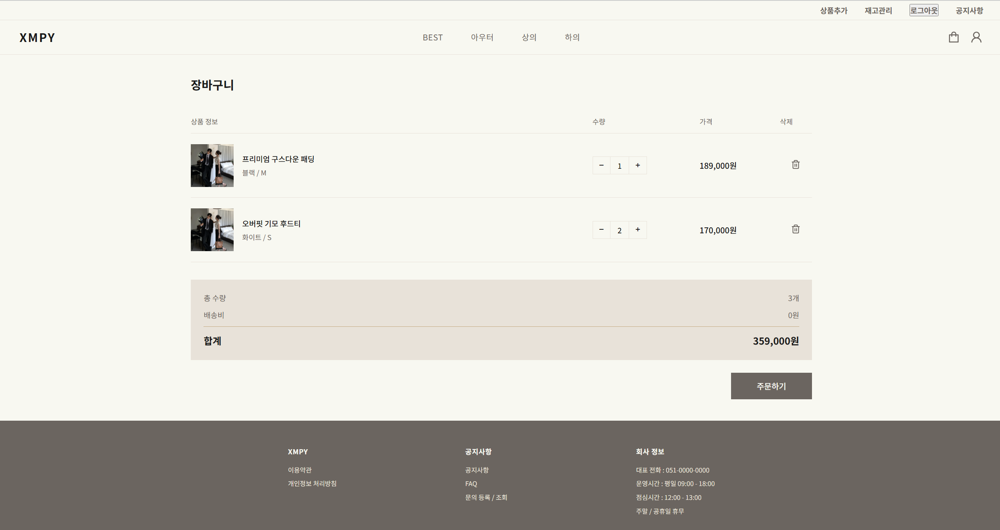

#### 결제


---

### 4. 로그인 & 회원가입
#### 로그인
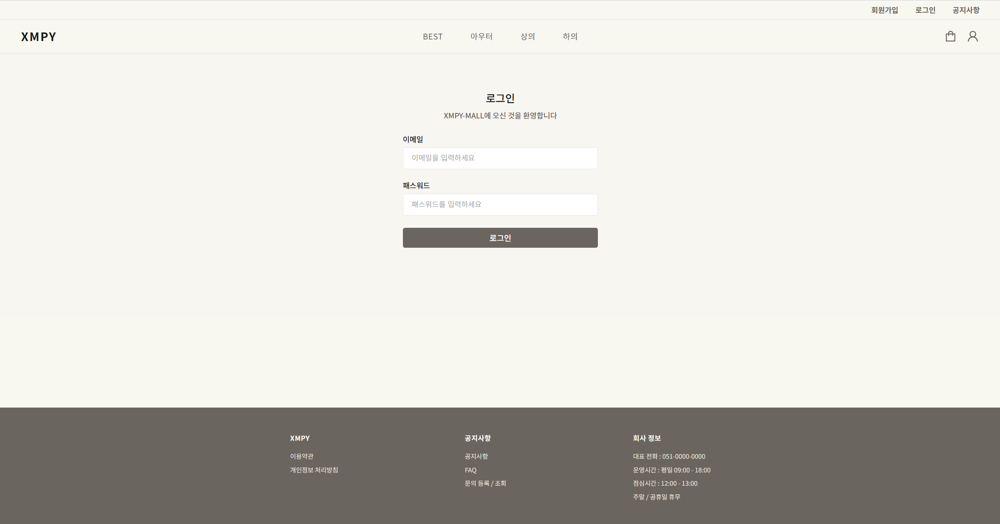

#### 로그인 성공 (사용자 / 관리자)
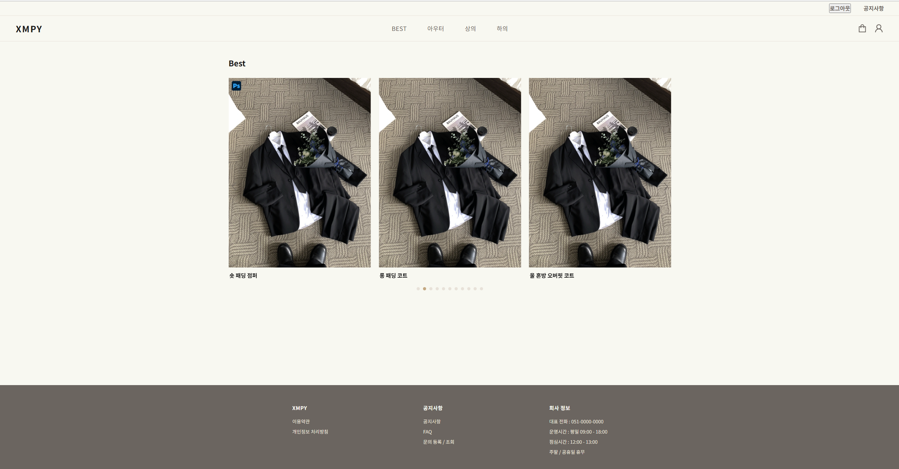
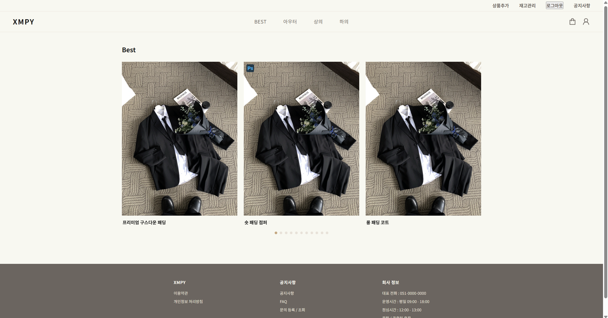

#### 회원가입
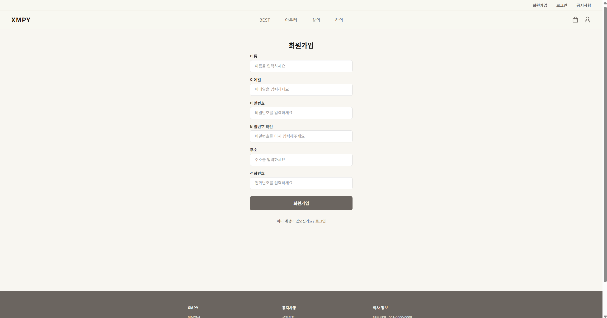

---

### 5. 마이페이지

#### 사용자 마이페이지
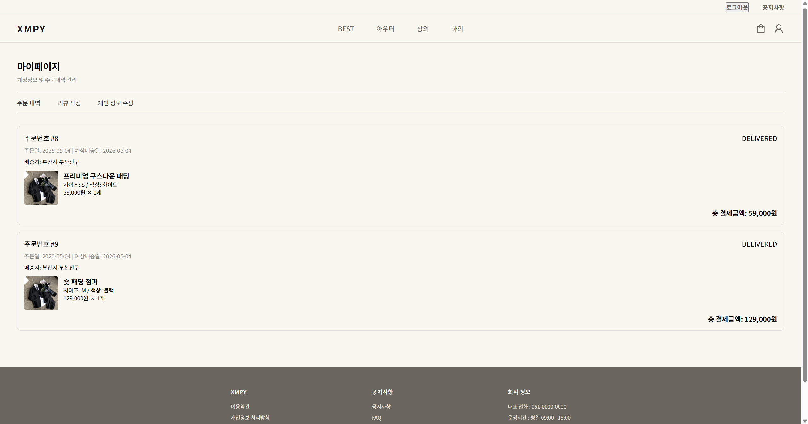

#### 관리자 마이페이지 - 주문 관리
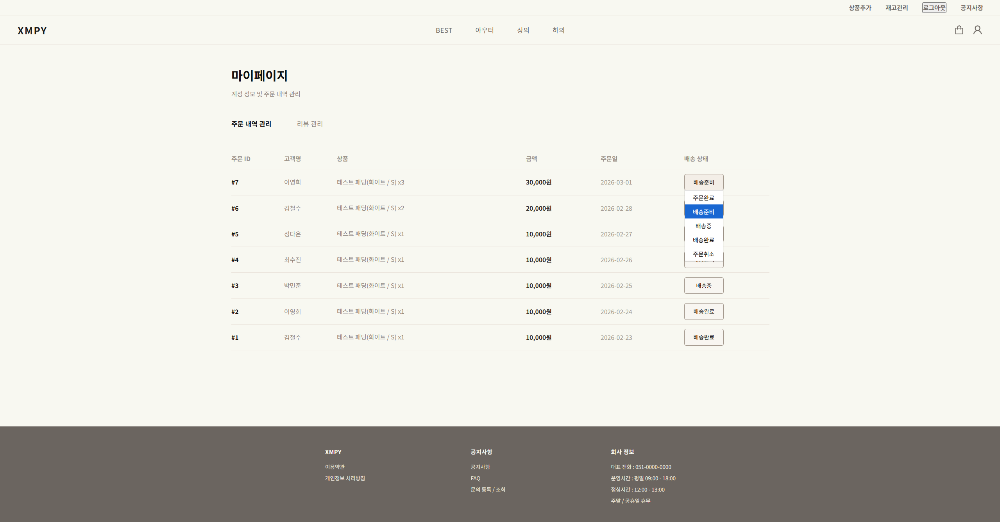

#### 관리자 마이페이지 - 리뷰 관리
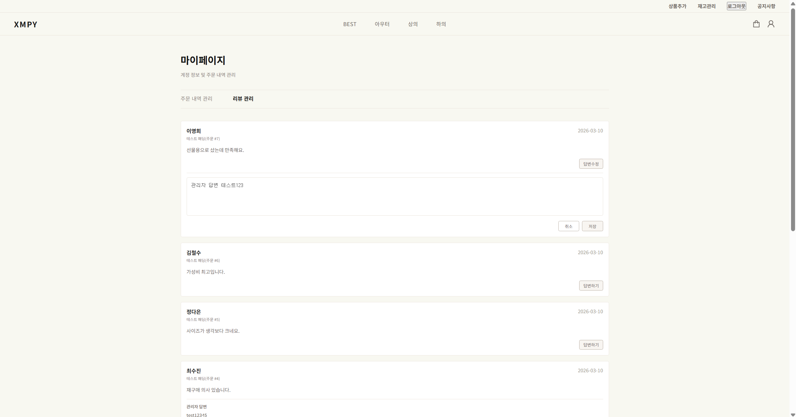

#### 관리자 - 상품 추가
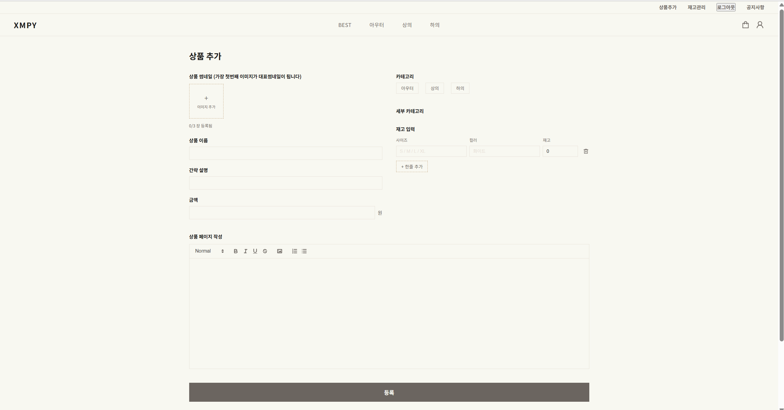

#### 관리자 - 재고 관리
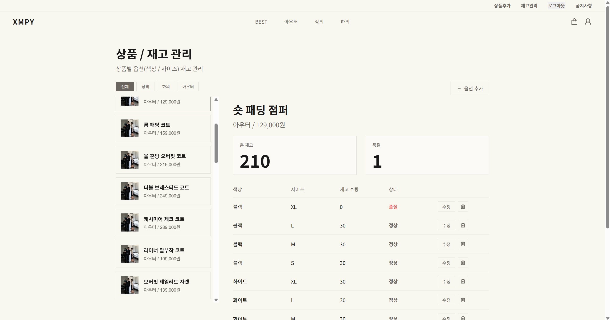

#### 관리자 - 옵션 추가
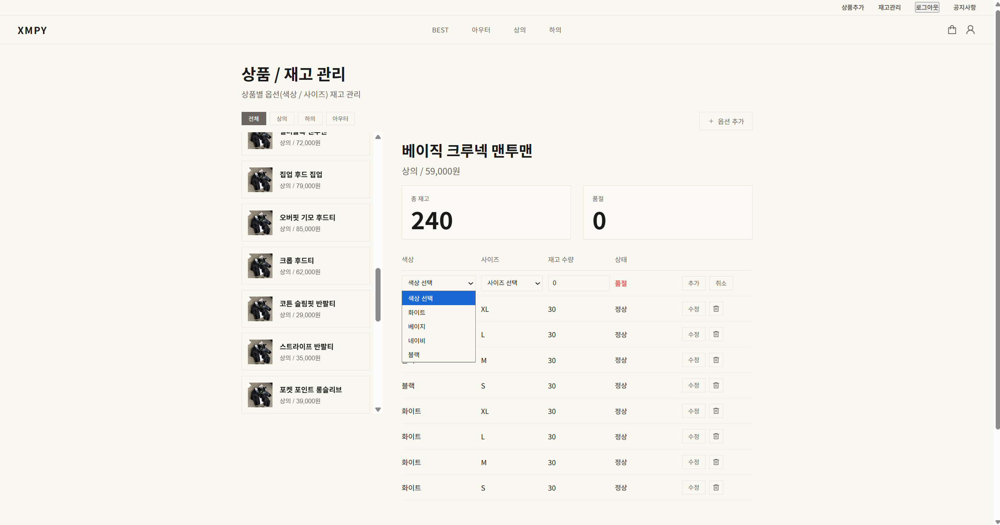
---

## 🛠️ 기술 스택

### Frontend

<p>
  
  
  
  
  
  
  
</p>
<p>
  
  
  
  
  
</p>
<p>
  
  
  
</p>

### Backend

<p>
  
  
  
  
</p>

### Database

<p>
  
</p>

### Security

<p>
  
  
</p>

### 외부 서비스

<p>
  
  
</p>

---

## 📂 Project Structure

### 🖥 Frontend

```bash
XMPY-MALL-FRONT/
└── src/
    ├── apis/                        # API 요청 관련 모듈 (Axios 기반)
    │   ├── instance.js              # Axios 인스턴스 (JWT, interceptors 설정)
    │   └── endpoints/               # 도메인별 API 함수 모음
    │       ├── admin.js             # 관리자 전용 API
    │       ├── auth.js              # 로그인 / 회원가입
    │       ├── category.js          # 카테고리 조회
    │       ├── order.js             # 주문 생성 / 조회
    │       ├── product.js           # 상품 조회 / 등록
    │       ├── review.js            # 리뷰 조회 / 작성
    │       ├── stock.js             # 재고 조회 / 수정
    │       └── user.js              # 유저 정보 조회 / 수정

    ├── assets/                      # 이미지 및 정적 리소스

    ├── components/                  # 공용 UI 컴포넌트
    │   ├── Spinner/
    │       ├── Spinner.jsx          # 로딩 스피너 컴포넌트

    ├── constants/                   # 전역 상수 관리
    │   ├── menu.jsx                 # 메뉴 및 라우트 정의
    │   ├── colors.js                # 색상 테마 상수
    │   └── images.js                # 이미지 경로 상수

    ├── hooks/                       # 공용 커스텀 훅
    │   ├── useCart.js               # 장바구니 상태 관리
    │   ├── useCategories.js         # 카테고리 데이터 조회
    │   ├── useForm.js               # 폼 상태 및 유효성 관리
    │   ├── useReviewItems.js        # 리뷰 목록 관련 로직
    │   └── useWriteReview.js        # 리뷰 작성 처리

    ├── layouts/                     # 공통 레이아웃
    │   ├── Header/                  # 상단 헤더 (카테고리 드롭다운 포함)
    │   │   ├── Header.jsx
    │   │   ├── styles.js
    │   │   └── components/
    │   │       └── CategoryDropDown/
    │   │           ├── CategoryDropDown.jsx   # 카테고리 드롭다운 UI
    │   │           └── styles.js
    │   ├── Footer/                  # 하단 푸터
    │   │   ├── Footer.jsx
    │   │   └── styles.js
    │   └── MainLayout/              # 공통 레이아웃 (Outlet 기반 페이지 구성)
    │       ├── MainLayout.jsx
    │       └── styles.js

    ├── pages/                       # 페이지 단위 (라우팅 기준)
    │   ├── Home/                    # 홈 (베스트 상품 슬라이더)
    │   │   ├── Home.jsx
    │   │   ├── styles.js
    │   │   └── useHome.js           # 홈 데이터 로직
    │
    │   ├── Mypage/                  # 마이페이지
    │   │   ├── Mypage.jsx
    │   │   ├── styles.js
    │   │   ├── hooks/
    │   │   │   ├── useUserInfo.js   # 사용자 정보 조회
    │   │   │   ├── useOrderList.js  # 주문 목록 조회
    │   │   │   ├── useMyReviews.js  # 내가 작성한 리뷰 조회
    │   │   │   ├── useReviewItems.js
    │   │   │   └── useWriteReview.js
    │   │   └── pages/
    │   │       ├── UserPage.jsx             # 일반 사용자 페이지
    │   │       ├── UserPage.module.css
    │   │       ├── OwnerPage.jsx            # 관리자 페이지
    │   │       ├── OwnerPage.module.css
    │   │       └── UserPageTabs/            # 탭 기반 UI
    │   │           ├── OrderList/
    │   │               ├── OrderList.jsx    # 주문 목록
    │   │           ├── OrderInfo/
    │   │               ├── OrderInfo.jsx    # 주문 상세
    │   │           ├── ReviewWrite/
    │   │               ├── ReviewWrite.jsx  # 리뷰 작성
    │   │               └── ReviewWrite.module.css
    │   │           └── UserInfo/
    │   │               ├── UserInfo.jsx     # 사용자 정보 수정
    │   │               └── UserInfo.module.css
    │
    │   ├── AddProduct/              # 상품 등록 (관리자)
    │   │   ├── AddProduct.jsx
    │   │   ├── styles.js
    │   │   ├── hooks/
    │   │   │   ├── useAddProduct.js     # 상품 등록 로직
    │   │   │   ├── useProductDetail.js  # 상품 상세 데이터 처리
    │   │   │   ├── useProductImage.js   # 이미지 관리
    │   │   │   └── useUploadImages.js   # 이미지 업로드
    │   │   └── components/
    │   │       ├── ProductCategories/
    │   │               ├── ProductCategories.jsx
    │   │               └── styles.js
    │   │       ├── ProductDetailInputs/
    │   │               ├── ProductDetailInputs.jsx
    │   │               └── styles.js
    │   │       ├── ProductImagePlaceHolder/
    │   │               ├── ProductImagePlaceHolder.jsx
    │   │               └── styles.js
    │   │       ├── ProductInfoInputs/
    │   │               ├── ProductInfoInputs.jsx
    │   │               └── styles.js
    │   │       └── ProductStockInputs/
    │   │               ├── ProductStockInputs.jsx
    │   │               └── styles.js
    │
    │   ├── Best/                    # 베스트 상품 페이지
    │   │   ├── Best.jsx
    │   │   └── styles.js
    │
    │   ├── CartPage/                # 장바구니 페이지
    │   │   ├── CartPage.jsx
    │   │   └── styles.js
    │
    │   ├── PaymentPage/             # 결제 페이지
    │   │   ├── PaymentPage.jsx
    │   │   ├── styles.js
    │   │   └── hooks/
    │   │       └── usePayment.js    # 결제 처리 로직
    │
    │   ├── ProductDetailPage/       # 상품 상세 페이지
    │   │   ├── ProductDetailPage.jsx
    │   │   ├── styles.js
    │   │   ├── hooks/
    │   │   │   ├── useProductDetail.js
    │   │   │   ├── useOrder.js
    │   │   │   └── useReviews.js
    │   │   └── components/
    │   │       ├── Order/
    │   │           ├── Order.jsx
    │   │           └── styles.js
    │   │       ├── ProductDetail/
    │   │           ├── ProductDetail.jsx
    │   │           └── styles.js
    │   │       ├── Reviews/
    │   │           ├── Reviews.jsx
    │   │           └── styles.js
    │   │       └── Thumbnail/
    │   │           ├── Thumbnail.jsx
    │   │           └── styles.js
    │
    │   ├── Signin/                  # 로그인 페이지
    │   │   ├── Signin.jsx
    │   │   ├── style.js
    │   │   └── hooks/
    │   │       └── useSignin.js
    │
    │   ├── Signup/                  # 회원가입 페이지
    │   │   ├── Signup.jsx
    │   │   ├── styles.js
    │   │   ├── hooks/
    │   │   │   └── useSignup.js
    │   │   └── components/
    │   │       └── FormInput.jsx
    │
    │   └── StockManagePage/         # 재고 관리 (관리자)
    │       ├── StockManagePage.jsx
    │       └── styles.js
    │
    │   ├── SubMenuPage/             # 카테고리별 상품 목록
    │   │   ├── SubMenuPage.jsx
    │   │   ├── styles.js
    │   │   ├── hooks/
    │   │   │   └── useSubMenu.js
    │   │   └── components/
    │   │       ├── ProductCard/
    │   │       │   ├── ProductCard.jsx
    │   │       │   └── styles.js
    │   │       └── Pagination/
    │   │           └── Pagination.jsx
    │
    ├── quill/                       # 에디터 (상품 설명 작성 등)
    │   ├── QuillEditor.jsx
    │   └── useQuillEditor.js

    ├── routes/                      # 라우팅 설정
    │   ├── AppRoutes.jsx            # 전체 라우트 정의
    │   ├── UserRoute.jsx            # 로그인 사용자 보호 라우트
    │   └── AdminRoute.jsx           # 관리자 보호 라우트

    ├── stores/                      # 상태 관리 (Zustand)
    │   └── authStore.js             # 인증 상태 관리

    ├── supabase/                    # Supabase 연동 설정
    │   └── supabase.js

    ├── App.jsx                      # 루트 컴포넌트
    └── main.jsx                     # 앱 진입점
```

---

### 🖥 Backend

```bash
XMPY-MALL-BACK/
└── src/
    ├── main/
    │   ├── java/com/xmpy/demo/
    │   │   ├── XmpyApplication.java        # Spring Boot 메인 실행 클래스
    │   │
    │   │   ├── config/
    │   │   │   └── SecurityConfig.java     # Spring Security 설정
    │   │
    │   │   ├── controller/                # 요청 처리 (API 엔드포인트)
    │   │   │   ├── AdminController.java
    │   │   │   ├── AuthController.java
    │   │   │   ├── CategoryController.java
    │   │   │   ├── MyPageController.java
    │   │   │   ├── OrderController.java
    │   │   │   ├── ProductController.java
    │   │   │   ├── ReviewController.java
    │   │   │   ├── StockController.java
    │   │   │   └── advice/
    │   │   │       └── GlobarExceptionHandler.java   # 전역 예외 처리
    │   │
    │   │   ├── dto/                       # 요청/응답 데이터 객체
    │   │   │   ├── req/                  # 요청 DTO
    │   │   │   │   ├── auth/
    │   │   │   │   │   ├── SignInReqDto.java
    │   │   │   │   │   └── SignupReqDto.java
    │   │   │   │   ├── mypage/
    │   │   │   │   │   └── ProfileUpdateReq.java
    │   │   │   │   ├── order/
    │   │   │   │   │   ├── AdminOrderUpdateReq.java
    │   │   │   │   │   └── OrderCreateReq.java
    │   │   │   │   ├── product/
    │   │   │   │   │   ├── ProductAddReq.java
    │   │   │   │   │   ├── ProductReqDto.java
    │   │   │   │   │   ├── ProductSearchReq.java
    │   │   │   │   │   └── ProductSort.java
    │   │   │   │   ├── review/
    │   │   │   │   │   ├── AdminReviewUpdateReq.java
    │   │   │   │   │   ├── ReviewCreateReq.java
    │   │   │   │   │   └── ReviewReqDto.java
    │   │   │   │   ├── stock/
    │   │   │   │   │   ├── StockAddReqDto.java
    │   │   │   │   │   └── StockUpdateReqDto.java
    │   │   │   │   └── user/
    │   │   │   │       └── UpdateUserReqDto.java
    │   │   │   │
    │   │   │   └── res/                 # 응답 DTO
    │   │   │       ├── auth/
    │   │   │       │   └── SigninRes.java
    │   │   │       ├── category/
    │   │   │       │   └── CategoryRes.java
    │   │   │       ├── order/
    │   │   │       │   ├── OrderItemResDto.java
    │   │   │       │   ├── OrderRes.java
    │   │   │       │   └── OrderResDto.java
    │   │   │       ├── product/
    │   │   │       │   ├── AdminProductStockRes.java
    │   │   │       │   ├── ProductBestCategoryRes.java
    │   │   │       │   ├── ProductBestItemRes.java
    │   │   │       │   ├── ProductCategoryMenu.java
    │   │   │       │   ├── ProductCategoryMenuRes.java
    │   │   │       │   ├── ProductCategoryMenuRowRes.java
    │   │   │       │   ├── ProductDetailRes.java
    │   │   │       │   ├── ProductListRes.java
    │   │   │       │   ├── ProductListRowRes.java
    │   │   │       │   ├── ProductPagingRes.java
    │   │   │       │   ├── ProductRes.java
    │   │   │       │   └── SubMenuResDto.java
    │   │   │       ├── review/
    │   │   │       │   ├── AdminReviewRes.java
    │   │   │       │   ├── MyReviewResDto.java
    │   │   │       │   ├── ReviewListRes.java
    │   │   │       │   ├── ReviewRes.java
    │   │   │       │   └── ReviewableItemResDto.java
    │   │   │       ├── stock/
    │   │   │       │   ├── StockResByProductId.java
    │   │   │       │   └── StockRespDto.java
    │   │   │       └── user/
    │   │   │           └── UserResDto.java
    │   │
    │   │   ├── entity/                # DB 테이블과 매핑되는 엔티티
    │   │   │   ├── Color.java
    │   │   │   ├── Inquiry.java
    │   │   │   ├── Notice.java
    │   │   │   ├── OrderItem.java
    │   │   │   ├── Orders.java
    │   │   │   ├── Product.java
    │   │   │   ├── ProductCategory.java
    │   │   │   ├── ProductCategoryDetail.java
    │   │   │   ├── ProductDetail.java
    │   │   │   ├── ProductThumbnail.java
    │   │   │   ├── Review.java
    │   │   │   ├── Role.java
    │   │   │   ├── Size.java
    │   │   │   ├── Stock.java
    │   │   │   └── User.java
    │   │
    │   │   ├── exeption/              # 커스텀 예외 처리
    │   │   │   ├── ProductException.java
    │   │   │   └── UserException.java
    │   │
    │   │   ├── jwt/                  # JWT 인증/인가 처리
    │   │   │   ├── JwtAuthentication.java
    │   │   │   ├── JwtAuthenticationFilter.java
    │   │   │   └── JwtUtil.java
    │   │
    │   │   ├── mapper/               # MyBatis Mapper 인터페이스
    │   │   │   ├── AuthMapper.java
    │   │   │   ├── CategoryMapper.java
    │   │   │   ├── ColorMapper.java
    │   │   │   ├── OrderMapper.java
    │   │   │   ├── ProductCategoryMapper.java
    │   │   │   ├── ProductDetailMapper.java
    │   │   │   ├── ProductMapper.java
    │   │   │   ├── ReviewMapper.java
    │   │   │   ├── SizeMapper.java
    │   │   │   ├── StockMapper.java
    │   │   │   └── UserMapper.java
    │   │
    │   │   ├── service/              # 비즈니스 로직 처리
    │   │   │   ├── AdminService.java
    │   │   │   ├── AuthService.java
    │   │   │   ├── CategoryMenuService.java
    │   │   │   ├── CategoryService.java
    │   │   │   ├── MyPageService.java
    │   │   │   ├── OrderService.java
    │   │   │   ├── ProductService.java
    │   │   │   ├── ReviewService.java
    │   │   │   ├── StockService.java
    │   │   │   └── UserService.java
    │   │
    │   │   └── view/
    │   │       └── ProductSubMenu.java   # DB View 매핑 객체
    │
    │   └── resources/
    │       ├── application.yaml        # 환경 설정 파일
    │       ├── mappers/                # MyBatis XML 쿼리
    │       │   ├── CategoryMapper.xml
    │       │   ├── ColorMapper.xml
    │       │   ├── OrderMapper.xml
    │       │   ├── ProductCategoryMapper.xml
    │       │   ├── ProductDetailMapper.xml
    │       │   ├── ProductMapper.xml
    │       │   ├── ReviewMapper.xml
    │       │   ├── SizeMapper.xml
    │       │   ├── StockMapper.xml
    │       │   └── UserMapper.xml
    │       └── sql/
    │
    └── test/
        └── java/com/xmpy/demo/
            └── XmpyApplicationTests.java   # 테스트 코드
```

